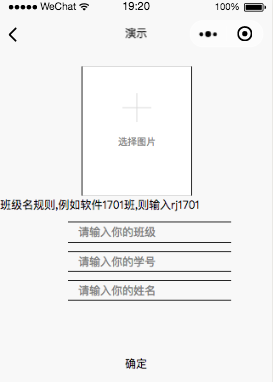
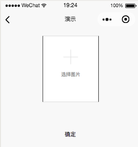

# WxAPITools
小程序api接口实例代码

  

已完成功能：

- 简单获取信息
  - 获取用户信息
  - 获取组的信息
- 简单上传数据
  - 上传用户信息
  - 上传组的信息
- 表单上传数据
  - 上传用户信息
  - 上传组的信息
- 个人定制API
  - 获取服务端信息
  - 上传信息到服务端
- 人脸数据集操作
  - 人脸数据入库
  - 人脸数据搜索

  

  

#### 人脸识别接口操作

1. 数据入库

   

2. 人脸搜索

   